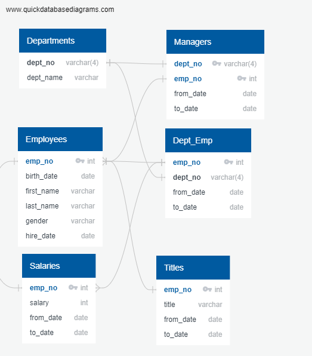

# Pewlett-Hackard-Analysis

## Project Overview
The overall purpose of this analysis was to determine whether the Pewlett-Hackard company is prepared for the predicted wave of retiring employees.  To address this concern, the analysis focused on answering two questions:
- How many employees are retiring per title?
- How many employees are eligible to participate in a mentorship program aimed at promoting from within the company to fill the predicted vacancies?

## Resources
Data Sources: departments.csv, dept_emp.csv, dept_manager.csv, emp_info.csv, employees.csv, salaries.csv, titles.csv  
Software: PostgreSQL11, Visual Studio Code 1.53.2, QuickDBD (https://www.quickdatabasediagrams.com/)

## Results

The following ERD was used as a map to enable SQL queries to answer the two questions:

 

The following query was used to determine the number of employees by title eligible for retirement:

	SELECT e.emp_no,
		e.first_name,
		e.last_name,
		ti.title,
		ti.from_date,
		ti.to_date
	INTO retirement_titles
	FROM employees as e
		INNER JOIN titles AS ti
			ON (e.emp_no = ti.emp_no)
	WHERE birth_date BETWEEN '1952-01-01' AND '1955-12-31'
	ORDER BY e.emp_no;

	-- Use Dictinct with Orderby to remove duplicate rows
	SELECT DISTINCT ON (rt.emp_no) rt.emp_no,
	rt.first_name,
	rt.last_name,
	rt.title
	INTO unique_titles
	FROM retirement_titles as rt
	ORDER BY rt.emp_no, to_date DESC;

	--count retiring employees by title
	SELECT COUNT (ut.title), ut.title
	INTO retiring_titles
	FROM unique_titles as ut
	GROUP BY ut.title
	ORDER BY COUNT(ut.title) DESC;``

The results of this query are shown below (the conversion of the excel file to a markdown table was performed using https://www.convertcsv.com/csv-to-markdown.htm):

|count|title             |
|-----|------------------|
|29414|Senior Engineer   |
|28254|Senior Staff      |
|14222|Engineer          |
|12243|Staff             |
|4502 |Technique Leader  |
|1761 |Assistant Engineer|
|2    |Manager           |

A total of 90,398 employees will be eligible for retirement.  
These employees are distributed over 7 different job titles with employees that have "Senior Engineer" or"Senior Staff" titles comprising over 63% of the eligible employees for retirement.

The analysis shows that:

- The revenue is greatest in Urban settings, followed by Suburban and Rural (lowest).
- The main contributor to the higher revenue in Urban settings is the significantly larger number of rides (13x number of rides in rural settings and 2.6x number of rides in suburban settings)
- The highest average fare per ride is obtained in rural areas ($34.62), followed by rides in suburband areas ($30.97) and rides in urban areas ($24.53).
- The average fare per driver is highest in rural areas ($55.49), followed by suburban ($39.50) and urban settings ($16.57).
- The revenue is not constant:  The analysis of the revenue from January to end of April, aggregated on a weekly basis shows that there are peaks of revenue.  These peaks do not coincide across different city types.

## Summary

The analysis suggests that:
- Increasing the number of drivers in rural areas may increase total revenue since 
    - in rural areas each driver completed an average of 1.6 rides compared to drivers in urban areas that completed only an average of 0.67 rides 
    - and the average fare per ride is significantly higher in rural than urban areas. 
- Rides in rural areas may cover longer distances since the average fare per ride is higher in these settings.  If that is case, placing vehicles that are energy efficient in these areas may result in an increase in profit.
- it may be worthwhile to increase the number of drivers in urban settings in the month of March - where there are the highest peaks of revenue.
